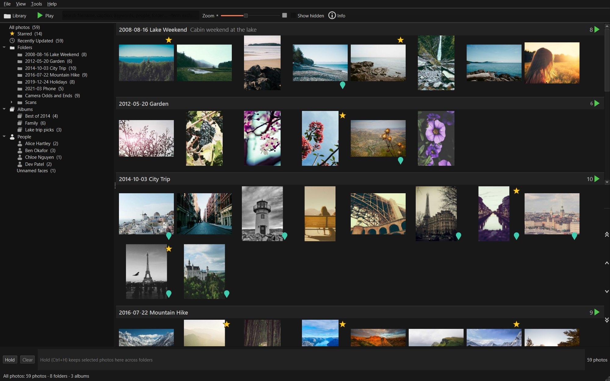
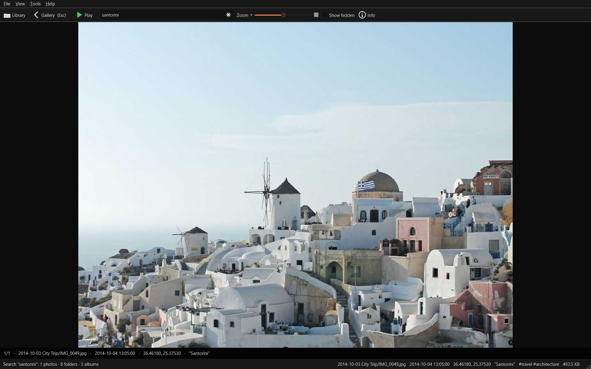
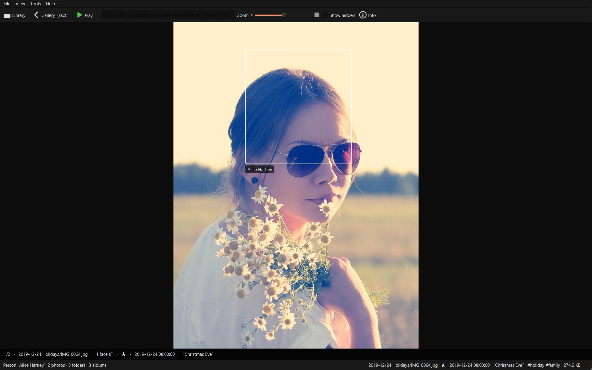
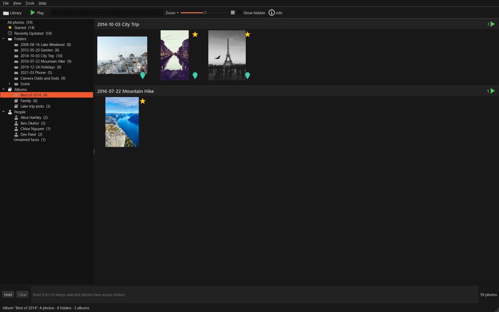
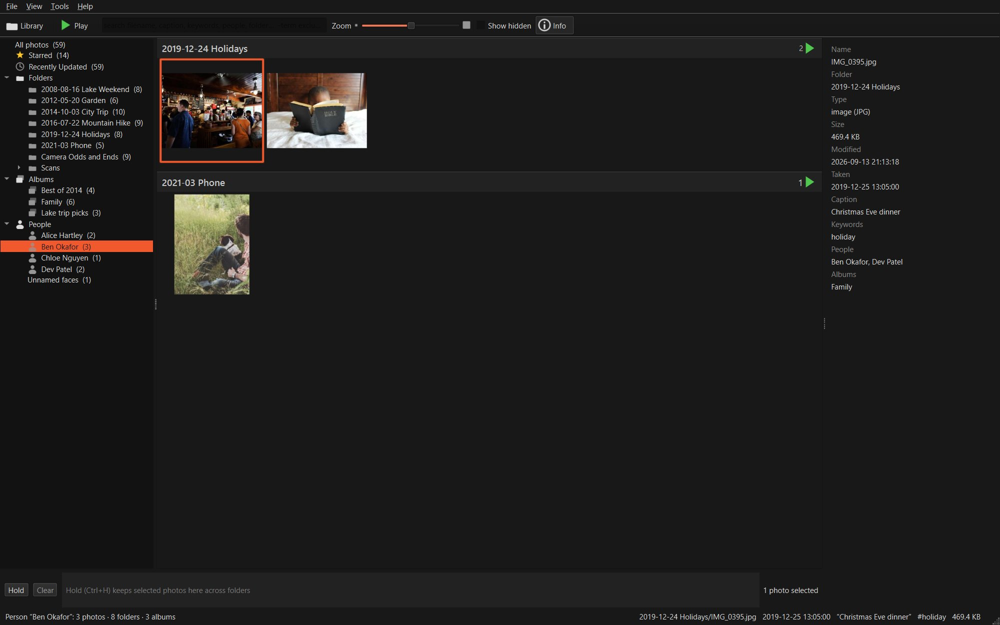
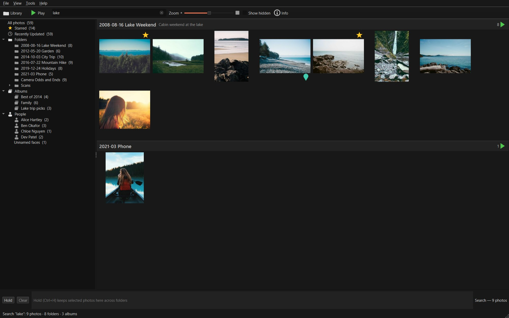
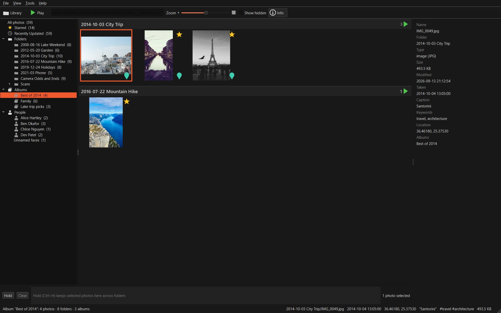
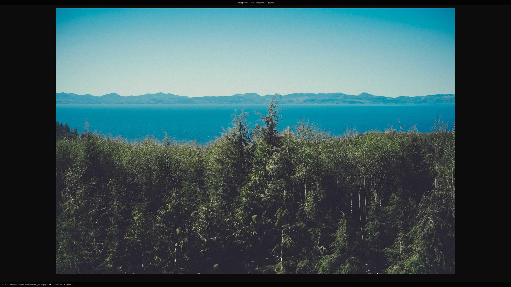
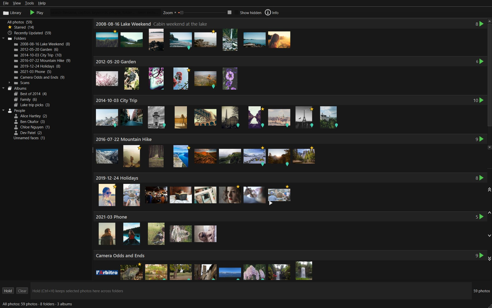

# Fauxcasa 0.1.0 - See your library again

Fauxcasa 0.1.0 shows you a Picasa photo library again. Point it at the
folder that holds your photos and it displays the same folders, albums,
people, stars and captions that Picasa did.

This version is for looking, not changing. It does not edit photos, add
tags, export, or write anything back to Picasa. Browsing never changes,
moves or deletes anything in your photo folders. The only things it ever
writes into a photo folder are two small bookkeeping files, and only if
you use the optional watched-folders import or the multi-folder
command-line features; see "What Fauxcasa writes on
your computer" below.

## Install and run

You need a Windows 10 or 11 PC, or a Linux desktop at least as new as
Ubuntu 22.04. Either must be 64-bit, which is almost every computer made
in the last decade. There is no Mac version yet.

### Windows

1. Download `fauxcasa-0.1.0-windows-x64.zip` from the
   [release page](https://github.com/maphew/fauxcasa/releases/latest).
2. Right-click the zip and choose **Extract All**. Keep the extracted
   folder together: the program needs the files next to it.
3. Open the extracted folder and double-click `fauxcasa.exe`.

Windows will most likely show a blue "Windows protected your PC" screen
the first time. Fauxcasa is not yet signed with a paid publisher
certificate, and Windows treats every unsigned program this way. Click
**More info**, then **Run anyway**. Only do this for a copy downloaded
from the release page above. To avoid the screen entirely: before
extracting, right-click the zip, open **Properties**, tick **Unblock**,
and click OK.

### Linux

1. Download `fauxcasa-0.1.0-linux-x64.tar.gz` from the
   [release page](https://github.com/maphew/fauxcasa/releases/latest).
2. Extract it: double-click it in your file manager, or run
   `tar -xzf fauxcasa-0.1.0-linux-x64.tar.gz` in a terminal.
3. Run the `fauxcasa` program inside the extracted folder: double-click
   it, or `./fauxcasa` in a terminal. It is already marked as executable,
   and the folder can live anywhere you like.

The build was made on Ubuntu 22.04 and needs a few common desktop
libraries. On Ubuntu 22.04 or newer, or Debian, this installs the ones it
was tested with:

```
sudo apt install libegl1 libgl1 libfontconfig1 libdbus-1-3 libpulse0 libxkbcommon0 \
  libxkbcommon-x11-0 libxcb-cursor0 libxcb-icccm4 libxcb-image0 \
  libxcb-keysyms1 libxcb-render-util0 libxcb-shape0 libxcb-xinerama0
```

On other distributions the package names differ, but they are the same
graphics, display, font and sound libraries that most desktop programs
already use; if the program does not start, running it from a terminal
usually shows which one is missing. Wayland desktops are fine: the
program runs through the XWayland layer that GNOME and KDE include. You
can also run from source instead; see "For developers" in the
[README](../../README.md).

### First start

Fauxcasa asks where your photos are:

- **Use Picasa's watched folders** appears when Picasa is installed on
  this Windows PC. Fauxcasa opens the same folders Picasa was watching.
- **Choose a folder…** lets you pick the top-level folder that holds
  your photos. Everything inside it, in all its subfolders, is included.

The window opens right away. Fauxcasa then looks through your folders in
the background and thumbnails fill in as it goes; a progress row under the
toolbar shows how far it has got. A large library takes a while the first
time: roughly a few thousand photos a minute on a typical computer, so
tens of thousands of photos mean several minutes, and a slow network
drive takes longer. You can browse while it works. After that, Fauxcasa remembers the library and starts in a second or
two. To open a different folder later, use the **Library** button on the
toolbar.

## What you can do

- **Browse** the way Picasa showed things: by folder (as a tree, or as a
  flat list with **View > Flat Folders**), by album, by person, plus
  Starred and Recently Updated. Folder descriptions from Picasa appear
  next to the folder names.
- **See your Picasa data**: captions, keywords, stars, face names and
  crops. Photos and folders you hid in Picasa stay hidden until you tick
  **Show hidden**.
- **Search** as you type. Several words narrow the results; a word with a
  minus in front (`-beach`) leaves those photos out. Search covers file
  names, captions, keywords, people and folder names.
- **View** a photo: double-click it, or select it and press Enter. Press
  `1` to see it pixel-for-pixel and drag to pan. The arrow keys move to
  the next and previous photo; Esc returns to the gallery. Press `F` to
  show the face boxes Picasa drew.
- **Hover peek**: hold Ctrl+Alt while pointing at a photo for a quick
  full-screen look without leaving the gallery.
- **Slideshow**: the **Play** button, or F11. Each folder header also has
  its own play button.
- **Videos** play with sound in the viewer: `P` plays and pauses,
  Ctrl+Left and Ctrl+Right skip five seconds.
- **Star** a photo with Space. Stars you set or remove in Fauxcasa are
  remembered in its own folder (see "What Fauxcasa writes on your
  computer"), never written into your library, so deleting that folder
  forgets them. Stars Picasa recorded show up too.
- **Info panel** (`I`, or the toolbar's **Info** button): the photo's
  details, such as date, size, place, caption, keywords, people and
  albums.
- **Gather photos from different folders** in the tray at the bottom:
  select photos and press Ctrl+H (Hold). They stay there while you move
  around the library.
- **File Types** (Tools menu): choose which kinds of files to include.
- **Formats**: JPEG, PNG, GIF, BMP, TIFF, WebP and TGA stills; RAW files
  (the unprocessed originals some cameras save) from 16 camera makers;
  Photoshop PSD; common video formats.
- **A library spread over more than one drive** keeps working when one of
  the drives is unplugged; those photos come back when it is plugged in
  again. For now, adding a second drive or folder to a library takes a
  few typed instructions that most people will not need; the appendix
  explains them.
- **Import notes**: if Fauxcasa finds something odd in your Picasa data,
  such as an album it cannot match or a name it cannot resolve, it counts
  it in the status bar as an import note. Click there to read them.

## What it looks like

The pictures below come from a demo library of freely licensed photos,
not anyone's family archive. Every name, album and face tag in them is
made up.



The gallery, grouped by folder. Picasa's folder descriptions appear next
to the folder names, starred photos carry a star, photos with a location
carry a marker.



The viewer. Double-click a photo, or select it and press Enter; Esc goes
back.



Press `F` in the viewer to see the face boxes Picasa drew, with the names
you gave them.



An album from Picasa. Albums can gather photos from several folders.



A person. Picasa's face tags become the People list, and the Info panel
shows who is in the selected photo.



Search as you type. This one matched a folder name, captions and
keywords at once.



The Info panel (`I`): date taken, caption, keywords, place and albums for
the selected photo.



The slideshow (the **Play** button or F11), here over the Starred view.



The zoom slider goes down to small thumbnails for scanning a big folder.

## What it cannot do yet

- No editing, tagging, cropping, exporting, printing or uploading. Nothing
  is written back to Picasa.
- Face names stored inside the photo files themselves, rather than in
  Picasa's `.picasa.ini` files, are not read yet. Captions and keywords
  stored inside RAW and TIFF files are not read.
- The custom order you gave folders in Picasa is not kept.
- Videos have no pixel-for-pixel view. Starring is not available while a
  slideshow is running.
- On Windows, a still image over 64 megapixels (a very large panorama or
  scan) cannot be opened in the viewer; an error tile is shown instead.
- On Windows, thumbnails of photos with a very tight Picasa crop (keeping
  less than about a seventh of the frame) look softer than the rest. The
  viewer shows the full-resolution crop as usual.
- Fast scrolling at the smallest thumbnail size can stutter on 4K and
  other very sharp (high-DPI) screens with very large libraries.
  Ordinary monitors are not affected.
- Import notes can be read but not searched, filtered or saved.
- Adding a second drive or folder to a library is not in the menus yet;
  it takes a few typed instructions (see the appendix).
- If you move or rename your photo folder, Fauxcasa treats it as a new
  library: it rebuilds its thumbnails, and the stars and view settings
  you set inside Fauxcasa do not follow. Stars, captions and albums that
  Picasa recorded live in your folders and come along.
- No Mac build, because there is no Mac available to build and test on.
- The Windows program is unsigned, so Windows warns about it (see above).

## Keyboard shortcuts

**Help > Keyboard Shortcuts** in the app shows this same list.

### Everywhere

| Action | Keys |
| --- | --- |
| Slideshow | `F11`, `Ctrl+4` |
| Info panel | `I` |

### Gallery

| Action | Keys |
| --- | --- |
| Select all | *SelectAll* (platform default, e.g. Ctrl+A) |
| Hold in tray | `Ctrl+H` |
| Star / unstar | `Space` |
| Deselect | `Ctrl+D` |
| Invert selection | `Ctrl+I` |
| Locate on disk | `Ctrl+Return`, `Ctrl+Enter` |
| Open in viewer | `Return`, `Enter` |
| Clear selection | `Esc` |
| Next photo | `Right`, `J` |
| Previous photo | `Left`, `K` |
| Move down a row | `Down` |
| Move up a row | `Up` |
| Jump to first photo | `Home` |
| Jump to last photo | `End` |

### Photo viewer

| Action | Keys |
| --- | --- |
| Close viewer | `Esc`, `Backspace` |
| Toggle 1:1 zoom | `1`, `Ctrl+Alt+0` |
| Hold in tray | `Ctrl+H` |
| Locate on disk | `Ctrl+Return`, `Ctrl+Enter` |
| Show face regions | `F` |
| Pan left | `Ctrl+Left` |
| Pan right | `Ctrl+Right` |
| Pan up | `Ctrl+Up` |
| Pan down | `Ctrl+Down` |
| Star / unstar | `Space` |
| Next photo | `Right`, `J` |
| Previous photo | `Left`, `K` |
| Play / pause video | `P` |
| Skip back 5 s | `Ctrl+Left` |
| Skip forward 5 s | `Ctrl+Right` |

### Slideshow

| Action | Keys |
| --- | --- |
| Pause / resume | `Space` |
| Next photo | `Right`, `J` |
| Previous photo | `Left`, `K` |
| Exit slideshow | `Esc`, `Backspace` |

### Hover peek

| Action | Keys |
| --- | --- |
| Dismiss hover peek | `Esc` |

Ctrl+Left and Ctrl+Right pan while you are zoomed in on a photo and skip
while a video is playing.

## What Fauxcasa writes on your computer

Fauxcasa keeps everything it makes for itself in one folder of its own,
away from your photos:

- Windows: `%LOCALAPPDATA%\Fauxcasa\cache`. Paste that into the File
  Explorer address bar to open it.
- Linux: `~/.cache/fauxcasa`, or `$XDG_CACHE_HOME/fauxcasa` if you have
  set that variable.

You can delete that folder at any time. Fauxcasa rebuilds it on the next
start. Nothing about your photos is lost, only Fauxcasa's own thumbnails
and the stars you set inside Fauxcasa.

The files below are Fauxcasa's own helper files. You never need to open
them; the list is here so you know exactly what is on your disk.

Inside that folder, one set of files per machine:

- `config.json`: the library you last opened, and your sort, view and
  File Types choices, one set per photo folder you have opened.
- `fauxcasa.log`: a diagnostic log, capped at about 4 MB. Include a copy
  with names and paths removed when reporting a bug.

And a subfolder for each library you have opened, containing:

- `catalog.json`: Fauxcasa's list of your photos and their Picasa data
  (sometimes stored compressed as `catalog.json.zst`: the same content,
  smaller).
- `thumbs.fcache` and `thumbs.fcache.json`: the thumbnails and their
  index.
- `stars.json`: the stars you set in Fauxcasa. Kept here, never written
  into your library.
- `config.json`: this library's sort mode, flat or tree view, and the
  window size and position.
- `import-report.json`: the import notes, that is, counts and details of
  oddities found in your Picasa data.

**Inside your photo folders**, and only if you use the optional
watched-folders or multi-folder features (the first-start **Use Picasa's
watched folders** button, or the advanced command-line options for
combining several folders into one library, listed in the appendix):

- `.fauxcasa-root`: a tiny marker file, written into each folder that is
  registered as part of a multi-folder library, so Fauxcasa can recognise
  the folder again if it moves. Every one of those features writes it,
  once per top-level folder registered, not in every subfolder. If it
  cannot be written, Fauxcasa carries on without it.
- `.fauxcasa/library.json`: the list of folders that make up a
  multi-folder library. `--promote` writes it inside the folder you
  promote (`<folder>/.fauxcasa/library.json`); `--import-picasa-watched`
  writes it at whatever location you give it, which may or may not be
  inside a watched folder; `--add-root` updates an existing one in place.
  The first-start **Use Picasa's watched folders** button is the
  exception: it keeps this file under Fauxcasa's own cache folder
  (`picasa-watched-library/.fauxcasa/library.json`), so it never lands
  inside your photo folders.

To remove Fauxcasa completely: delete the extracted program folder, the
cache folder above, and, if you used those features, the `.fauxcasa-root`
and `.fauxcasa/library.json` files.

Fauxcasa never connects to the internet. It has no accounts, uploads,
update checks or usage reports. A firewall that asks per program will
never ask about it.

## Upgrading from the August preview

Skip this if you never tried the earlier test version from August
(`tracer-test-v1`). If you did: extract this version and run it; it finds
your photos again on its own. The preview kept its cache in a
folder named `fauxcasa-tracer` under your user cache directory
(`~/.cache/fauxcasa-tracer` on Linux). This version does not use it, and
you can delete it. Everything new since the preview is listed at the end
of these notes.

## Getting help and reporting problems

Report problems on the project's
[issue page](https://github.com/maphew/fauxcasa/issues). The bug-report
form asks for what is needed. A free GitHub account is required to post.

Please keep your private things private. Do not include photos, Picasa
files (`.picasa.ini`, `.pal`, `contacts.xml`, the database), real names
or real folder paths in a report. Do include:

- The version, shown by **Help > About** in the app. (The technically
  inclined can also run `fauxcasa-console.exe --version`.)
- Your operating system and version, and your display scaling if it is
  not 100%.
- What you did, what happened, and what you expected.
- A copy of `fauxcasa.log` (location above) with names and paths removed.

For a security problem, please use
[private reporting](https://github.com/maphew/fauxcasa/security/advisories/new)
instead of a public issue; see [SECURITY.md](../../SECURITY.md).

---

## Appendix: technical details

You can stop reading here. The rest is for people who want to check the
download, use the command line, or see how this release was tested. The
keyboard tables above are generated from `apps/desktop-python/keymap.py`.

### Verifying the download

Each release archive is published alongside a `SHA256SUMS` file. Compare
the download's hash against the matching line:

```
# Windows (PowerShell or cmd)
certutil -hashfile fauxcasa-0.1.0-windows-x64.zip SHA256

# Linux/macOS
sha256sum fauxcasa-0.1.0-linux-x64.tar.gz
```

To confirm an archive was built by this project's CI, not substituted or
tampered with in transit, use GitHub's build provenance attestation
(needs the [GitHub CLI](https://cli.github.com/)):

```
gh attestation verify fauxcasa-0.1.0-windows-x64.zip --repo maphew/fauxcasa
```

This proves the file came from a GitHub Actions run in this repository. It
does not make Windows trust the binary; SmartScreen still shows its
warning.

### Command-line options

`fauxcasa.exe --help` on Windows (`fauxcasa-console.exe --help` prints in
the terminal) or `./fauxcasa --help` on Linux lists everything. The
options a user might want:

| Option | What it does |
| --- | --- |
| `fauxcasa <folder>` | open that folder as the library instead of the remembered one |
| `--version` | print the version and exit |
| `--cache-root <path>` | keep Fauxcasa's cache somewhere else |
| `--rebuild` | ignore the existing cache and rebuild it |
| `--min-image-size WxH`, `--max-image-size WxH` | skip icon-sized or enormous images while scanning |
| `--contacts <file>`, `--pal-dir <dir>`, `--db3 <dir>` | point at Picasa's `contacts.xml`, its `.pal` album folder, or its database when they are not in the usual `%LocalAppData%\Google\Picasa2` place (all read-only) |
| `--promote` | turn the given folder into a multi-folder library (writes `.fauxcasa/library.json` inside it) |
| `--add-root <path>` | add another folder to an already promoted library |
| `--import-picasa-watched <list>` | build a multi-folder library from a list of folders: a text file with one path per line (`#` lines are comments), or the word `registry` to read Picasa's own list on Windows |
| `--require-sandbox` | exit with an error instead of carrying on unsandboxed if the Windows decode sandbox cannot start |

Setting `FAUXCASA_DECODE_SANDBOX=0` in the environment turns the Windows
decode sandbox off. It is on by default.

A second group of options exists for scripted runs and screenshots
(`--screenshot`, `--view`, `--search`, `--select`, `--info`, `--open`,
`--faces`, `--play`, `--window-size` and friends). They are documented
with the developer notes in `apps/desktop-python/README.md`; the pictures
in this document were made with them.

### The decode sandbox, precisely

On Windows, still images (JPEG, PNG, GIF, BMP, TIFF, WebP, TGA) are
decoded inside an AppContainer sandbox for thumbnails and the viewer.
RAW, PSD, 16-bit TIFF and video are decoded in-process; on Linux
everything is in-process. If the sandbox cannot start, the app says so in
the status bar and decodes in-process. `FAUXCASA_DECODE_SANDBOX=1` is
already the default on Windows; `--require-sandbox` makes a sandbox
failure fatal instead of degrading, and `FAUXCASA_DECODE_SANDBOX=0`
turns it off. Still images over `decodesvc.MAX_PIXELS` (64 MP) return
TOO_LARGE in the sandboxed viewer on Windows, where the in-process path
handled them before. The scan-time header size sniff also runs
in-process. Only open libraries whose files you trust. The design is in
`docs/decode-threat-model.md`.

### Where 0.1 stands against the M1 definition

The product spec's M1 gate ("See your library again") has three clauses:

1. **N4 budgets green on the 100k synthetic library.** Mostly green;
   scrolling at minimum zoom on high-DPI displays remains over budget
   (tracked: `fauxcasa-q6l.27`).
2. **`picasa_db.py survey` cross-check shows zero ingest loss on synthetic
   corpora.** Green in CI (`scripts/check-ingest-parity.py`).
3. **Owner confirms the same on the family archive.** Not yet recorded;
   this is a pending owner action (tracked: `fauxcasa-6g8`). See
   `docs/m1-gate-confirmation.md` for the runbook and confirmation record.

### Provenance

Recorded from the release-candidate builds on 2026-09-13.

- Pinned build environment: PySide6-Essentials 6.11.1 and PySide6-Addons
  6.11.1, PyInstaller 6.20.0, rawpy 0.27.0, python-exiv2 0.18.1, Pillow
  12.3.0, PyAV 18.0.0, zstandard 0.23.0, on CPython 3.12 (pinned in the
  workflows). Runners: `windows-2022` and `ubuntu-22.04`.
- Release pipeline: `.github/workflows/release.yml` builds both archives,
  runs the frozen-artifact smoke gates (including the sandboxed decode
  gate on Windows), writes `SHA256SUMS`, attaches a GitHub build-provenance
  attestation, and creates a draft pre-release. Proven end to end on the
  `v0.1.0-rc1` dry run (README.html rendered from these notes,
  `gh attestation verify` succeeds on the downloaded zip).
- Test suites on the tagged commit: tracer 579 passed / 2 skipped; decode
  sandbox 189 passed (real AppContainer workers); decode facade 22;
  sandbox end-to-end 7; picasa_db 94 passed / 11 oracle-gated skips;
  confirm-archive 21; ingest-parity gate PASS (25 classes, zero loss).
- Frozen Windows artifact on the developer's Windows 11 box, headless, 100k
  synthetic photos with a prebuilt thumbnail cache adopted: warm start
  823 ms (catalog load 453 ms) against the 2 s budget; first adopt bind
  4.4 s; about 244 MB resident at ready. Not reference hardware, and not
  a full-fidelity index run; the scroll benchmark at minimum zoom on a 4K
  display is still owed (see "What it cannot do yet").

### Licensing

Fauxcasa uses strong copyleft by default so the work and its community
remain a commons.

- Application code, scripts, tests, and build files:
  `AGPL-3.0-or-later`.
- Project documentation (including these release notes): `CC-BY-SA-4.0`.
- Third-party dependency license notices are bundled inside each release
  archive as `THIRD-PARTY-NOTICES.md`.
- Corresponding source for this release is the tagged commit `v0.1.0` in
  this repository. The AGPL's network-use clause means any modified
  version reachable over a network must offer that source too.

See `LICENSE`, `docs/LICENSE.md`, and `CONTRIBUTING.md` for the full
terms.

### Since tracer-test-v1

Everything below landed between the August preview (`tracer-test-v1`,
commit `553d31a`) and this release:

- Video playback with audio, and video poster thumbnails
- Info panel (`I`) with the photo's catalog metadata
- Non-blocking first run: the window appears immediately, the walk runs
  in the background
- Flat and tree folder views; folder descriptions in tooltips
- Compressed (zstd) catalog storage
- Still images decoded inside a Windows AppContainer sandbox for
  thumbnails and the viewer, on by default, with an honest status-bar
  note when the sandbox cannot start
- A wordless app icon and Windows taskbar identity; a version
  (`--version`, Help > About); product names for the cache directory,
  log file and executables
- A coherent dark theme, icons in the toolbar and sidebar, selection and
  hover feedback, readable group headers with folder descriptions,
  labelled error tiles, empty-state messages, File/View/Tools/Help menus
  with a generated keyboard-shortcuts dialog, remembered window geometry
- A first-run welcome that can build a library from Picasa's own watched
  folders; hover chevrons in the viewer
- Lower-resolution thumbnail decode at small zoom on high-DPI displays
  (faster minimum-zoom scrolling)
- Fixes: stars no longer vanish when File Types change; the Starred view
  updates when a photo is unstarred; a reconcile rebuild now lands on
  Windows while thumbnails are open; a library switch no longer wipes
  File Types choices; captions and names always render literally; the
  activity row no longer spins forever; the inspector refreshes after
  indexing; a decoder that raises no longer wedges the viewer on
  "loading..."; a bad XMP rating no longer aborts indexing; import notes
  from another library's Picasa database no longer appear for unrelated
  folders
- Release engineering: a tag-driven release workflow with checksums and
  build provenance, a native Windows rendering check in CI, third-party
  license notices, a security policy and a bug-report form
