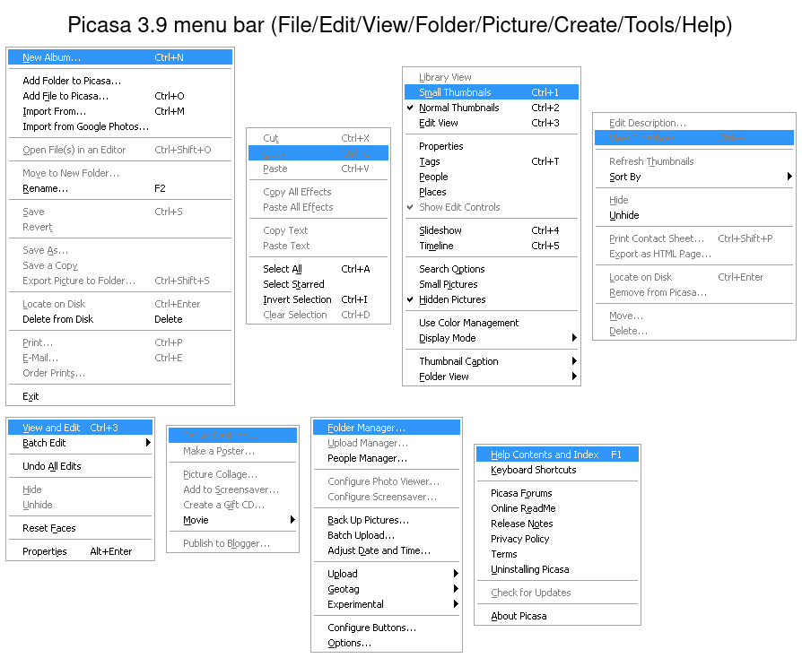
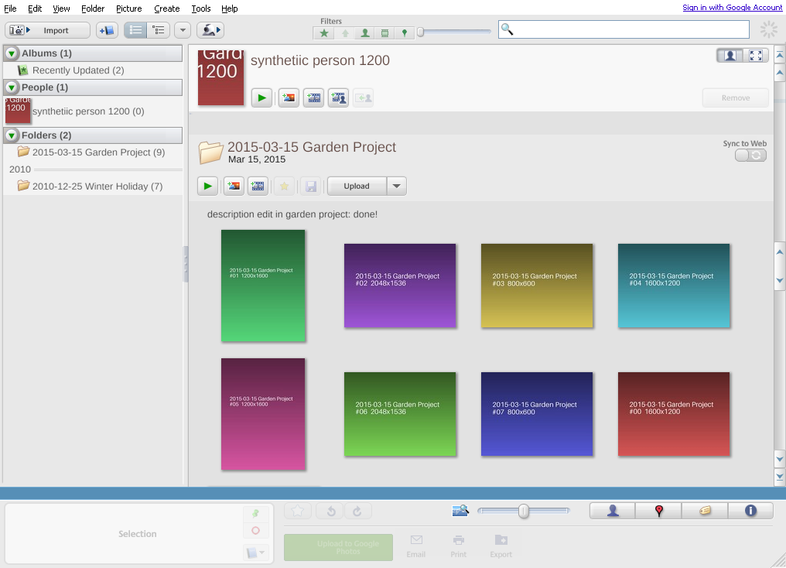
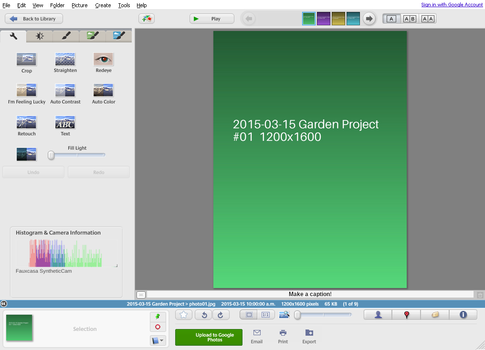
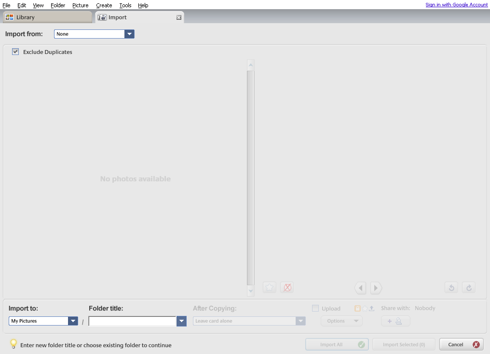

# Picasa 3.9 UI inventory & Fauxcasa priority ranking

A complete inventory of every menu item, button, widget, and action in **Google
Picasa 3.9**, captured by driving the real binary live, with a **preliminary
implementation-priority ranking (1–5; negative = anti-feature)** for Fauxcasa.

Produced 2026-06-15 (bead `fauxcasa-dfa`).

## At a glance

~224 ranked rows across 8 menus, 4 context menus, the edit room (5 tabs / **36
effects** / 5 tool panels), 4 side panels, and 6 modes/dialogs:

| Rank | Rows | What it is |
|---|---:|---|
| **5** core | 40 | The Soul + N1–N7 made visible (browse, search, folders-tree, stars, non-destructive edit, delete→trash). |
| **4** v1-IN | 90 | The explicit v1 feature set. |
| **3** later/secondary | 54 | v1.5–v2 scope + necessary plumbing. |
| **2** nice-to-have | 16 | Niche display modes, extra effect packs. |
| **1** legacy-harmless | 4 | Dead links, obsolete display tuning. |
| **−1 … −3** anti-feature | 20 | Cloud lock-in & dead Google services — every one a named OUT/non-goal. |

The single loudest signal: **the entire cloud surface is anti-feature
territory** — "Sign in with Google" (−3) plus ~20 Upload / Web Albums / YouTube /
Blogger / Order-Prints / Gift-CD / Google-Earth items (−2). They fill much of the
Create and Tools menus and the whole bottom action bar, and the spec marks every
one OUT. Cutting them is the Soul, not a loss.

## How this was produced

The inventory is **empirical**, not from memory or 2011-era writeups. Real
Picasa 3.9 was driven under the headless Wine oracle (`docs/research/wine-oracle.md`):

- A throwaway CoW clone of the oracle prefix (`cache/wine-oracle-inventory`) so
  the live differential-fixture baseline stayed untouched; the dead Places/Maps
  busy-loop pre-disabled (`active_metadata_tab=""`, `ieframe` override).
- Picasa launched onto a headless `weston`/Xwayland (`:2`); every surface driven
  with `xdotool` and captured per-window with ImageMagick `import -window`
  (override-redirect dropdowns and dialogs don't appear in a root grab).
- Each menu walked coordinate-free (Alt focuses the menu bar, `Right` cycles
  top-level menus, `Down`+`Right` expands submenus); context menus by right-click;
  edit mode by double-click; panels via the View menu / shortcuts.
- Captures archived under `cache/ui-capture/` (synthetic library only — privacy-safe).

Reference figures: `docs/research/picasa-ui/` — `menus.png` (all 8 menus),
`library-view.png`, `edit-view.png`, `import-screen.png`.

## Ranking scale

Ranks are grounded in `docs/product-spec.md` (§1 Soul / non-goals, §2 N1–N7
non-negotiables, §5 feature scope IN / LATER / OUT). This is **implementation
priority for a faithful local-first Picasa**, not a judgment of Picasa itself.

| Rank | Meaning |
|---|---|
| **5** | Core / non-negotiable — a Soul point, an N1–N7 item, or v1-IN core (browse, search, folders-as-truth, stars, non-destructive edit + durable undo, basic crop/straighten/rotate, delete→trash). |
| **4** | Important and explicitly **v1-IN**. |
| **3** | In scope but **LATER** (v1.5/v2), or a useful secondary v1 item, or necessary desktop plumbing. |
| **2** | Nice-to-have / niche / low priority (advanced display modes, extra effect packs). |
| **1** | Marginal / cosmetic / legacy-but-harmless. |
| **−1** | Weak anti-feature (mild against-soul or dead-service, low harm). |
| **−2** | Clear anti-feature — a named OUT / non-goal item. |
| **−3** | Strong anti-feature — actively against the Soul (fake security, phone-home, hard cloud lock-in). |

The Soul forbids, **permanently**: any cloud/hosted-service dependence (Google
sign-in, Web Albums, Google Photos / Collaborative / YouTube upload, Google
email, BlogThis!, Shop, print-ordering, Gift CD, Picnik); Google-Earth/Maps-API
coupling; password-protected "hiding" (security theater); auto-install
updates / telemetry / phone-home; copy-into-app-library; auto-curation pushed at
the user. Those map to the negative ranks below.

---

## 1. Menu bar

### File

| Item | Rank | Tier | Notes |
|---|---|---|---|
| New Album… (Ctrl+N) | 4 | v1-IN | Albums = references layered on folders (N1); create/fill both ways. |
| Add Folder to Picasa… | 5 | core | Add a watched root — the whole "folders on disk are truth" entry point. |
| Add File to Picasa… (Ctrl+O) | 3 | v1 | File-granularity add; folder-level watching is the real model. |
| Import From… (Ctrl+M) | 4 | v1-IN | Import-from-device, one-screen flow. |
| Import from Google Photos… | −2 | ANTI | Hosted-service dependence. |
| Open File(s) in an Editor… (Ctrl+Shift+O) | 3 | LATER | External-tool path (export-then-act, consent-gated). |
| Move to New Folder… | 4 | v1-IN | Real file operation (organize). |
| Rename… (F2) | 4 | v1-IN | Rename / batch rename (pattern+counter). |
| Save (Ctrl+S) | 5 | core | Bake edits + stash original (N2 non-destructive). |
| Revert | 5 | core | Undo-save; "no harm done." |
| Save As… | 3 | v1 | Export variant. |
| Save a Copy | 3 | v1 | Export variant. |
| Export Picture to Folder… (Ctrl+Shift+S) | 5 | core | Export-with-edits; multi-resolution is a treasured workflow. |
| Locate on Disk (Ctrl+Enter) | 4 | v1-IN | Reveal in file manager. |
| Delete from Disk (Delete) | 5 | core | Delete → OS trash, never direct unlink. |
| Print… (Ctrl+P) | 3 | LATER | Print + contact sheets. |
| E-Mail… (Ctrl+E) | 4 | v1-IN | Re-implemented as "for email" preset → `mailto:`/`xdg-email`; **no Google**. |
| Order Prints… | −2 | ANTI | Cloud print-ordering (Shop). |
| Exit | 4 | plumbing | Expected. |

### Edit

| Item | Rank | Tier | Notes |
|---|---|---|---|
| Cut / Copy / Paste (Ctrl+X/C/V) | 3 | plumbing | Standard primitives. |
| Copy All Effects / Paste All Effects | 3 | v1 | Rides the durable edit-recipe model (apply one photo's edits to others). |
| Copy Text / Paste Text | 2 | nice | Text-overlay copy; niche. |
| Select All (Ctrl+A) | 5 | core | Selection tray is the universal input to every output action. |
| Select Starred | 3 | v1 | Selection-by-filter. |
| Invert Selection (Ctrl+I) | 4 | v1-IN | Selection management. |
| Clear Selection (Ctrl+D) | 4 | v1-IN | Hold/Clear is explicit v1. |

### View

| Item | Rank | Tier | Notes |
|---|---|---|---|
| Library View | 5 | core | The grid. |
| Small / Normal Thumbnails (Ctrl+1/2) | 4 | v1-IN | Thumbnail zoom (a slider in Fauxcasa). |
| Edit View (Ctrl+3) | 5 | core | The edit room, one double-click away. |
| Properties | 4 | v1-IN | Metadata inspector panel. |
| Tags (Ctrl+T) | 4 | v1-IN | Keywords panel. |
| People | 4 | v1-IN | People panel. |
| Places | 3 | LATER | Geotag map panel (provider-swappable, not Maps-API). |
| Show Edit Controls | 2 | nice | Minor toggle. |
| Slideshow (Ctrl+4) | 4 | v1-IN | Basic slideshow doubles as a triage pass. |
| Timeline (Ctrl+5) | 3 | LATER | Timeline view. |
| Search Options | 3 | v1 | Search configuration. |
| Small Pictures | 3 | v1 | Part of the one inspectable filter surface (footgun 10 — no invisible hide). |
| Hidden Pictures | 4 | v1-IN | The single inspectable hidden-filter UI (N7). |
| Use Color Management | 2 | nice | Color-managed display. |
| **Display Mode** ▸ Automatic | 3 | v1 | Sensible default. |
| Display Mode ▸ 24-bit / 16-bit dithered / Remote Desktop / LCD Whitepoint / Projector / overflow pixels / Mac Gamma 1.6 / Linear Gamma 2.2 / Sepia / B&W | 1 | legacy | 2009-era display-tuning; mostly obsolete. |
| **Thumbnail Caption** ▸ None / Filename / Caption / Tags / Resolution | 3 | v1 | Thumbnail caption mode (corner badges + caption line). |
| **Folder View** ▸ Flat / Tree | 4 | v1-IN | Flat + tree folder views. |
| Folder View ▸ Sort by Creation Date / Recent Changes / Size / Name / Reverse | 4 | v1-IN | Tree sort modes. |
| Folder View ▸ Shortcuts ▸ Desktop / My Documents / My Pictures / My Computer | 3 | v1 | Quick "add this root" shortcuts. |
| Folder View ▸ Show Thumbnails in Library / Simplified Tree View | 2 | nice | Tree-density toggles. |

### Folder

| Item | Rank | Tier | Notes |
|---|---|---|---|
| Edit Description… | 3 | v1 | Folder description (round-trips to `.picasa.ini` `[Picasa]`). |
| View Slideshow (Ctrl+4) | 4 | v1-IN | Per-folder play. |
| Refresh Thumbnails | 4 | v1-IN | Re-scan / rebuild (maintenance). |
| **Sort By** ▸ Name / Date / Size / Reverse order | 4 | v1-IN | Per-folder sort modes. |
| Hide / Unhide | 4 | v1-IN | One inspectable cosmetic-hide feature (N7); labeled as such, never security. |
| Print Contact Sheet… (Ctrl+Shift+P) | 3 | LATER | Contact sheets. |
| Export as HTML Page… | 3 | LATER | Static-gallery export (serverless heir to Sync-to-Web). |
| Locate on Disk (Ctrl+Enter) | 4 | v1-IN | |
| Remove from Picasa… | 4 | v1-IN | Un-watch (library-only; file untouched). |
| Move… | 4 | v1-IN | Move Folder (cross-volume copy-verify-delete). |
| Delete… | 5 | core | Delete folder → trash. |

### Picture

| Item | Rank | Tier | Notes |
|---|---|---|---|
| View and Edit (Ctrl+3) | 5 | core | Enter the edit room. |
| **Batch Edit** ▸ Rename (F2) | 4 | v1-IN | Batch rename. |
| Batch Edit ▸ Rotate Clockwise / Counterclockwise (Ctrl+R / Ctrl+Shift+R) | 5 | core | Lossless rotate. |
| Batch Edit ▸ Auto Contrast / Auto Color / I'm Feeling Lucky | 4 | v1-IN | One-click basic fixes, batched. |
| Batch Edit ▸ Sepia / Sharpen / Warmify / Film Grain / Black and White | 4 | v1-IN | The classic one-clicks, batched. |
| Batch Edit ▸ Auto Red Eye Correction | 4 | v1-IN | Batched redeye. |
| Batch Edit ▸ Show Text / Hide Text | 2 | nice | Text-overlay visibility. |
| Undo All Edits | 5 | core | Per-photo durable undo (the strongest emotional peak in the corpus). |
| Hide / Unhide | 4 | v1-IN | Single inspectable hide feature (N7). |
| Reset Faces | 4 | v1-IN | "One-action remove all face data." |
| Properties (Alt+Enter) | 4 | v1-IN | |

### Create

| Item | Rank | Tier | Notes |
|---|---|---|---|
| Set as Desktop | 2 | nice | OS wallpaper integration. |
| Make a Poster… | 2 | nice | Tiled-print poster; niche. |
| Picture Collage… | 3 | LATER | Collage. |
| Add to Screensaver… | 2 | LATER | Screensaver. |
| Create a Gift CD… | −2 | ANTI | Disc-burning gift CD (OUT; backup-to-path survives the *idea*). |
| **Movie** ▸ From Selection | 4 | v1-IN | Minimal movie/slideshow renderer (owner priority). |
| Movie ▸ From Faces in Selection / From People Albums | 3 | v1 | Variants riding people data. |
| Publish to Blogger… | −2 | ANTI | BlogThis! — dead Google service. |

### Tools

| Item | Rank | Tier | Notes |
|---|---|---|---|
| Folder Manager… | 5 | core | Watched/excluded roots, 3-state policy (N1). |
| Upload Manager… | −2 | ANTI | Cloud upload queue. |
| People Manager… | 4 | v1-IN | Manage people albums / contacts. |
| Configure Photo Viewer… | 3 | LATER | Standalone fast viewer + OS file associations. |
| Configure Screensaver… | 2 | LATER | |
| Back Up Pictures… | 4 | v1-IN | Backup Sets to a path/drive. |
| Batch Upload… | −2 | ANTI | Cloud. |
| Adjust Date and Time… | 3 | v1 | Bulk date shift (metadata edit). |
| **Upload** ▸ Google Photos / Collaborative Web Album / YouTube | −2 | ANTI | Hosted-service dependence (all three). |
| **Geotag** ▸ Geotag With Google Earth / View in Google Earth | −2 | ANTI | Google-Earth coupling (Maps-API decayed twice). |
| Geotag ▸ Clear Geotags | 3 | v1 | Local geotag edit — fine. |
| Geotag ▸ Export to Google Earth File | 1 | legacy | KML export — benign interop, low value. |
| **Experimental** ▸ Show Duplicate Files | 3 | LATER | Duplicate management (owner priority, post-faces). |
| Experimental ▸ Search for… / Save search results | 3 / 2 | v1 / nice | Search; saved-search persistence. |
| Experimental ▸ Show tag as album | 2 | nice | Tag→album projection. |
| Experimental ▸ Passport photo… | 1 | niche | Passport-size print layout. |
| Experimental ▸ Delete empty online albums… | −2 | ANTI | Cloud album management. |
| Experimental ▸ Choose database location… | 3 | v1 | Library-location config. |
| Experimental ▸ Write faces to XMP… | 4 | v1-IN | Face-data interop (import/export all face data, XMP). |
| Configure Buttons… | 3 | LATER | Custom buttons / external-tool API. |
| Options… | 4 | plumbing | Preferences (file types, slideshow, etc.). |

### Help

| Item | Rank | Tier | Notes |
|---|---|---|---|
| Help Contents and Index (F1) | 3 | plumbing | |
| Keyboard Shortcuts | 3 | plumbing | Picasa-compatible bindings are the default scheme. |
| Picasa Forums / Online ReadMe / Terms | 1 | legacy | Dead external links. |
| Release Notes | 2 | plumbing | |
| Privacy Policy | 2 | plumbing | Thin surface (no cloud / no telemetry). |
| Uninstalling Picasa | 2 | plumbing | Install/uninstall is side-effect-free (a Soul point). |
| Check for Updates | 3 | v1 | **Opt-in, off by default** version check — the entire network surface. |
| About Picasa | 2 | plumbing | |

---

## 2. Context menus

Right-click menus largely duplicate the menu bar; rank the **distinct** items
(shared items inherit their menu-bar rank).

### Photo (grid right-click)

| Item | Rank | Tier | Notes |
|---|---|---|---|
| View and Edit (Enter) | 5 | core | |
| Add to Album ▸ | 4 | v1-IN | |
| Rotate CW / CCW | 5 | core | |
| Undo all Edits | 5 | core | |
| Hide | 4 | v1-IN | Single inspectable hide feature (N7). |
| Move to New Folder… | 4 | v1-IN | |
| Split Folder Here… | 3 | v1 | Split a folder at a photo boundary (real file op). |
| Open File / Open With ▸ | 3 | LATER | External-tool path. |
| Save / Revert | 5 | core | |
| Locate on Disk | 4 | v1-IN | |
| Delete from Disk (Ctrl+Delete) | 5 | core | |
| Copy Full Path | 3 | v1 | |
| Upload to Picasa Web Albums | −2 | ANTI | |
| Block from Uploading | −1 | ANTI | Cloud-upload bookkeeping. |
| Reset Faces | 4 | v1-IN | |
| Properties (Alt+Enter) | 4 | v1-IN | |

### Folder (tree right-click)

| Item | Rank | Tier | Notes |
|---|---|---|---|
| Edit Folder Description… | 3 | v1 | |
| Select All Pictures (Ctrl+A) | 5 | core | |
| Clear / Invert Selection | 4 | v1-IN | |
| Move to Collection ▸ | 3 | v1 | Collections (year grouping / named collections). |
| Refresh Thumbnails | 4 | v1-IN | |
| Sort Folder By ▸ | 4 | v1-IN | |
| Hide Folder | 4 | v1-IN | Single inspectable hide feature (N7); cosmetic, not security. |
| Locate on Disk | 4 | v1-IN | |
| Remove from Picasa… | 4 | v1-IN | |
| Move Folder… | 4 | v1-IN | |
| Delete Folder… | 5 | core | |
| Upload to Google Photos… | −2 | ANTI | |
| Export as HTML Page… | 3 | LATER | |
| Add name tags | 4 | v1-IN | Face name-tagging entry point. |

### Album (tree right-click)

| Item | Rank | Tier | Notes |
|---|---|---|---|
| Edit Album Description… | 3 | v1 | |
| Select All / Clear / Invert | 4–5 | v1-IN | |
| Refresh Thumbnails | 4 | v1-IN | |
| Sort Album By ▸ | 4 | v1-IN | |
| Delete Album | 4 | v1-IN | Removes the reference, not the files (N1). |
| Upload to Google Photos… | −2 | ANTI | |
| Export as HTML Page… | 3 | LATER | |
| Add name tags | 4 | v1-IN | |

### Person (People right-click)

| Item | Rank | Tier | Notes |
|---|---|---|---|
| Edit People Album… | 4 | v1-IN | Rename / manage a person. |
| Select All / Clear / Invert | 4 | v1-IN | |
| Refresh Thumbnails | 4 | v1-IN | |
| Sort Album By ▸ | 4 | v1-IN | |
| Delete People Album | 4 | v1-IN | |

---

## 3. Library chrome (toolbar, tree, filters, tray, headers)

| Element | Rank | Tier | Notes |
|---|---|---|---|
| **Top toolbar** — Import button | 4 | v1-IN | |
| Thumbnail view-mode toggles (list / grid) | 4 | v1-IN | |
| View-options dropdown (▼) | 3 | v1 | |
| **Filters bar** — Starred filter | 5 | core | Star threshold filter (≥N). |
| Filters — Faces/People filter | 4 | v1-IN | |
| Filters — Geotagged filter | 3 | LATER | Pairs with the geotag map panel. |
| Filters — Uploaded filter | −1 | ANTI | "Has been uploaded to Google" — cloud-state filter, obsolete. |
| Filters — date-range slider | 3 | v1 | |
| **Search box** (instant, as-you-type) | 5 | core | Negation, people, captions, filenames; native All-Photos view. |
| "Sign in with Google Account" link | −3 | ANTI | The headline non-goal: no accounts, no sign-in. |
| Picasa logo busy-spinner | 3 | v1 | Inline scan/activity progress (modes-not-modals). |
| **Left tree** — Albums / People / Folders sections | 5 | core | The sidebar folder list *is* the filesystem (N1). |
| **Folder header** — Play Slideshow | 4 | v1-IN | |
| Folder header — Create Collage | 3 | LATER | |
| Folder header — Create Movie | 4 | v1-IN | |
| Folder header — Star all | 4 | v1-IN | |
| Folder header — Save all | 5 | core | Bake pending edits in the folder. |
| Folder header — Upload (+dropdown) | −2 | ANTI | |
| Folder header — Sync to Web toggle | −2 | ANTI | Hosted mirroring (idea survives as static-gallery export, LATER). |
| Folder header — inline editable description | 3 | v1 | |
| Person/album header — Play / Collage / Movie / merge / add-to-album / Remove | 3–4 | v1 | Per-person actions. |
| **Bottom tray** — Star | 5 | core | Stackable 0–5 stars. |
| Bottom tray — Rotate CCW / CW | 5 | core | |
| Bottom tray — photo-tray / loupe button | 3 | v1 | |
| Bottom tray — thumbnail-size zoom slider | 5 | core | "Instant grid"; zoom is part of the speed identity. |
| Bottom tray — People / Tags / Properties panel toggles | 4 | v1-IN | |
| Bottom tray — Places panel toggle | 3 | LATER | |
| **Selection tray** — Hold / Clear / actions dropdown | 5 | core | Persistent cross-folder selection; type-aware readout. |
| **Bottom action bar** — Upload to Google Photos | −2 | ANTI | |
| Bottom action bar — Email | 4 | v1-IN | Via `mailto:`/`xdg-email`. |
| Bottom action bar — Print | 3 | LATER | |
| Bottom action bar — Export | 5 | core | The treasured multi-resolution / watermark export. |

---

## 4. Edit mode (the Picasa bar, no more)

| Element | Rank | Tier | Notes |
|---|---|---|---|
| Back to Library | 5 | core | "Modes, not modals." |
| Tag-faces button | 4 | v1-IN | |
| Play | 4 | v1-IN | |
| Prev/next + filmstrip | 5 | core | |
| Compare modes (A / A·B / before-after) | 3 | v1 | Before/after sells "no harm done." |
| Caption field ("Make a caption!") | 4 | v1-IN | |
| Status bar (folder>file, date, dims, size, N of M) | 4 | v1-IN | Dual collection/single mode. |
| Histogram & Camera Information panel | 3 | v1 | |
| **Tab 1 Basic Fixes** — Crop | 5 | core | Aspect presets labeled as ratios, preview-then-revert. |
| Basic Fixes — Straighten | 5 | core | |
| Basic Fixes — Redeye | 4 | v1-IN | |
| Basic Fixes — I'm Feeling Lucky | 4 | v1-IN | |
| Basic Fixes — Auto Contrast / Auto Color | 4 | v1-IN | |
| Basic Fixes — Retouch | 4 | v1-IN | Brush-size slider, before/after. |
| Basic Fixes — Text | 4 | v1-IN | Font/size/style/align/color/transparency. |
| Basic Fixes — Fill Light slider | 5 | core | The signature one-slider fix. |
| Basic Fixes — Undo / Redo | 5 | core | Operation-named, durable. |
| **Tab 2 Tuning** — Fill Light / Highlights / Shadows / Color Temperature / Neutral Color Picker | 4 | v1-IN | The tuning sliders + neutral picker. |
| **Tab 3 Effects pack 1 (12 classic)** — Sharpen, Sepia, B&W, Warmify, Film Grain, Tint, Saturation, Soft Focus, Glow, Filtered B&W, Focal B&W, Graduated Tint | 4 | v1-IN | "The 12 classic tiles with live previews." |
| **Tab 4 Effects pack 2 (12)** — Infrared Film, Lomo-ish, Holga-ish, HDR-ish, Cinemascope, Orton-ish, 1960's, Invert Colors, Heat Map, Cross Process, Posterize, Duo-Tone | 2 | nice | Picasa 3.9's expansion packs; beyond the spec's "12 classic." |
| **Tab 5 Effects pack 3 (12)** — Boost, Soften, Vignette, Pixelate, Focal Zoom, Pencil Sketch, Neon, Comic Book, Border, Drop Shadow, Museum Matte, Polaroid | 2 | nice | Expansion pack. |
| Crop sub-panel (dimension dropdown, presets, Rotate/Preview/Reset/Apply/Cancel) | 5 | core | |
| Straighten sub-panel (grid + angle slider) | 5 | core | |
| Text sub-panel (font/size/B-I-U/align/color/transparency/Copy Caption/Clear All) | 4 | v1-IN | |
| Retouch sub-panel (brush size, before/after) | 4 | v1-IN | |
| **Side panel** — Tags (add field, tag list, Quick Tags grid + gear) | 4 | v1-IN | |
| Side panel — People (confirm/name faces) | 4 | v1-IN | Suggested→confirmed/ignored state machine. |
| Side panel — Places (map, Street Map dropdown, address search) | 3 | LATER | |
| Side panel — Properties (Location/Size/Dims/Camera/dates/JPEG Quality/Unique ID) | 4 | v1-IN | |

---

## 5. Modes & dialogs

| Element | Rank | Tier | Notes |
|---|---|---|---|
| **Import screen** (Import-from, Exclude Duplicates, picker, Import-to, Folder title, After-Copying, Import All/Selected/Cancel) | 4 | v1-IN | Linear one-screen flow; dup-exclusion on by default; "leave card alone" default. |
| Import — per-photo star / exclude-X | 4 | v1-IN | X = reverse-star muscle memory. |
| Import — Upload checkbox / Share-with | −2 | ANTI | Cloud share at import. |
| **Slideshow** controls — prev / play / next / Exit | 4 | v1-IN | |
| Slideshow — Star (and reverse-star) overlay | 5 | core | Slideshow doubles as a triage pass. |
| Slideshow — transition dropdown / caption toggle / Display-Time / zoom / rotate | 3 | v1 | |
| **Configure Buttons** dialog (Available/Current lists, Add/Remove/Move, Reset) | 3 | LATER | Custom-button / external-tool API surface. |
| **Tools ▸ Options** preferences (General / File Types / Slideshow / E-Mail / etc.) | 4 | plumbing | File-type include/exclude is v1-IN; cloud/email tabs are ANTI. |
| **Folder Manager** (watched / excluded roots, 3-state) | 5 | core | |
| **People Manager** | 4 | v1-IN | |
| **Back Up Pictures** (Backup Sets) | 4 | v1-IN | Discs replaced by drives. |
| **Movie Maker** | 4 / LATER | v1-IN | Minimal renderer in v1; full Movie Maker (audio/captions/transitions) LATER. |
| **Picture Collage** editor | 3 | LATER | |
| **Print** layout | 3 | LATER | |
| **Email composer** | 4 | v1-IN | `mailto:`/`xdg-email`, no Google. |
| **Export** dialog | 5 | core | |
| **Adjust Date and Time** | 3 | v1 | |
| **Upload Manager** | −2 | ANTI | |
| **Make a Poster / Gift CD / Order Prints / Screensaver** | 2 / −2 / −2 / 2 | mixed | Poster & screensaver niche-LATER; Gift CD & Order Prints OUT. |

---

## 6. Anti-features (consolidated)

Everything ranked negative, grouped by the Soul non-goal it violates:

**Cloud / hosted-service dependence (−2/−3)** — Sign in with Google Account
(−3); Import from Google Photos; Upload to Google Photos / Collaborative Web
Album / YouTube; Upload Manager; Batch Upload; Sync to Web toggle; folder-header
& tray Upload buttons; Upload-to-Picasa-Web-Albums / Block-from-Uploading
(context); Delete empty online albums; Import & action-bar "Share with"; Order
Prints; Publish to Blogger; Create a Gift CD; "Uploaded" filter (−1).

**Dead Google-service coupling (−2)** — Geotag With Google Earth; View in Google
Earth (the *capability* — local geotag editing and a provider-swappable map
panel are fine; the Google-Earth/Maps-API binding is not).

**Correctly absent (no negative item — their absence is itself spec-correct)** —
three banned behaviors have **no** UI element in 3.9, so there is nothing to rank
negative; the point is to keep them absent: password-protected hiding (security
theater — 3.9 only has cosmetic hide; any re-implementation must stay cosmetic
and labeled); auto-install updates / phone-home / telemetry (only the
off-by-default opt-in `Check for Updates` exists, the entire network surface);
copy-into-app-library import (Picasa never copies into a managed library — keep
it that way).

> **Why this matters for scoping:** the cloud surface is a *large* fraction of
> the Create and Tools menus and the whole bottom action bar. Cutting it isn't a
> loss — it's the Soul. Every one of these decayed when its Google service
> churned; the durable core (face tags, edits, stars) was 100% local.

## 7. The core (rank 5)

Add a watched folder; the folder tree (= filesystem); instant search; Select
All / selection tray (Hold/Clear); Library & Edit views; thumbnail zoom; stars;
rotate; crop; straighten; fill light; Save/Revert/Undo-All-Edits (durable,
operation-named undo); Delete→trash; Folder Manager; Export. These are the Soul
and the N1–N7 constitution made visible.

## 8. Gaps & deltas

**Picasa capabilities the inventory confirms but the spec down-scopes:** the
two extra effect packs (24 of the 36 effects are Picasa-3.9 expansions beyond
the spec's "12 classic"); the legacy Display-Mode color-tuning list; Maps/Earth
geotag actions.

**Spec v1-IN features with *no* (or only partial) Picasa-3.9 UI equivalent**
(build these *new*, not ported) — flagged so the inventory isn't mistaken for
the feature list:

*High priority (owner-requested / named v1-IN, under-represented in the UI):*

- **Reverse-star / reject — first-class controls.** Picasa only had import-time
  exclude. Missing: a **bottom-tray Reject button** (peer to Star), the **X-key
  reject** in grid/viewer/slideshow, a **reject control in the slideshow
  overlay** (the spec puts star *and* reverse-star there so playback is a triage
  pass), and a **`Rejected` auto-collection** sidebar node.
- **Auto-collections as sidebar nodes** — **Starred Photos** (scoped), **Recently
  Updated**, **Rejected**, **Exports**. Picasa's sidebar only gestures at
  "Recently Updated"; the set (especially Exports and Rejected) needs to be
  first-class.
- **A native All-Photos view** (Picasa needed a negation-search hack).
- **Undo Save** (N2 names Save / Undo Save / Revert) — un-bake the file while
  keeping edits live. *Present in Picasa but appears only after a save, so it was
  not in these captures* — note this as a capture limitation, not a Picasa gap.
- **Multi-resolution export + text watermark** — both field-named as treasured,
  currently buried inside the generic Export dialog; surface them explicitly.
- **Honest People surface** — explicit unnamed-faces affordance + a visible count
  of not-yet-face-scanned photos (no silent pre-recognition gap, N7).
- **Make-permanent metadata gesture + sidecar-vs-in-file state cue (P1)** —
  `Write faces to XMP` covers faces only; the general per-photo/batch
  make-permanent gesture + metadata-state cue + undo journal have no UI here.
- **Library-as-document** — open-library-by-path and multiple libraries (the
  reason PicasaStarter existed); `Choose database location` covers *cache* only.

*Lower priority (partial coverage, worth itemizing):*

- **Jump-to-folder / jump-to-end buttons** replacing Picasa's footgun recentering
  thumb (only the plain scrollbar maps over).
- **One-click verify/rebuild + per-folder health + "what does the app think about
  this file?" inspector** (only loosely mapped by Refresh Thumbnails).
- **Library-local trash** where the OS/NAS has none.
- **Holder-identity lock indicator** ("opened by user@host since 14:02";
  concurrency) — new, not in Picasa.
- **Keyboard triage bindings** (J/K next/prev, 0–5 star-set keys, X reject, 1:1
  zoom toggle, hover full-screen peek) — listed in Picasa's shortcuts but the
  peek and 1:1 affordances are only partly surfaced.
- **Updatable RAW decode** (never a frozen in-binary table — Picasa's biggest
  functional decay) and **bundled video decoders** (Picasa delegated to system
  codecs).

## Verification

Rankings were cross-checked by an independent multi-agent pass: seven agents
ranked the surfaces in isolation against `product-spec.md`, then a reconciliation
critic enforced cross-surface consistency (same capability → same rank: Folder
Manager, Undo-All-Edits/Revert, Properties, Reset Faces, Hide/Unhide, Sort-by-Size,
Move-to-New-Folder all normalized) and produced the gaps list above. Their
corrections are folded in.

---

*Captures: `cache/ui-capture/` (synthetic library, privacy-safe). Method:
`docs/research/wine-oracle.md`. Ranking authority: `docs/product-spec.md`.*
